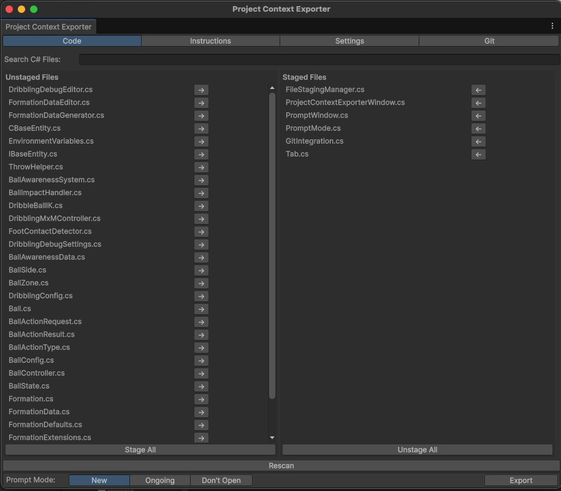
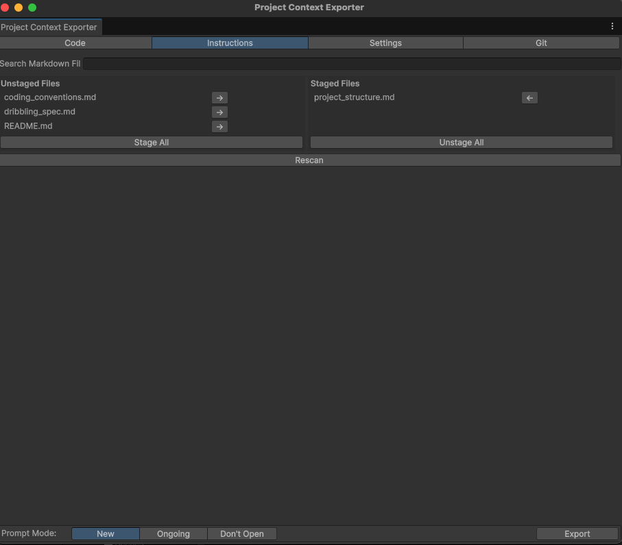
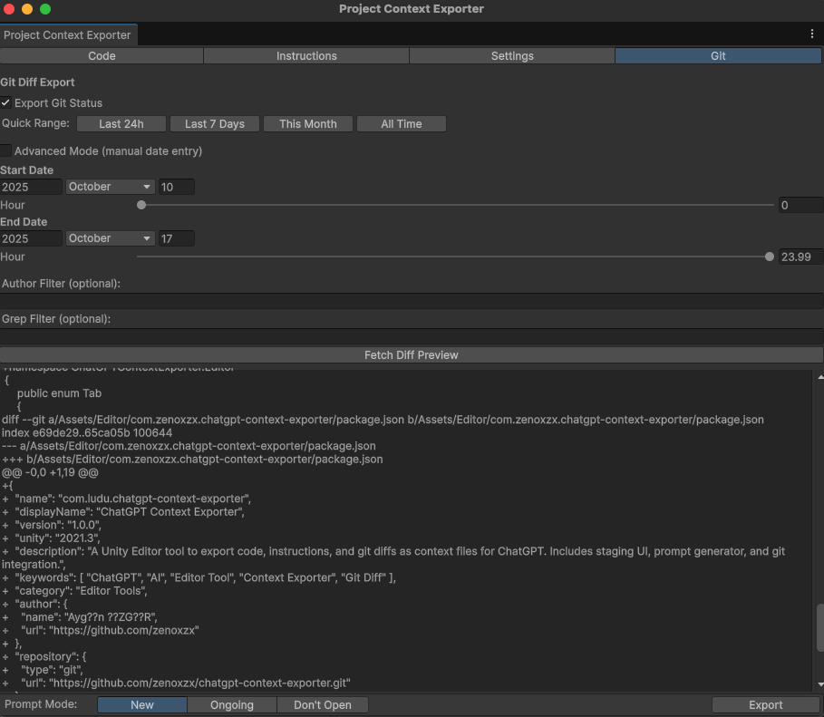
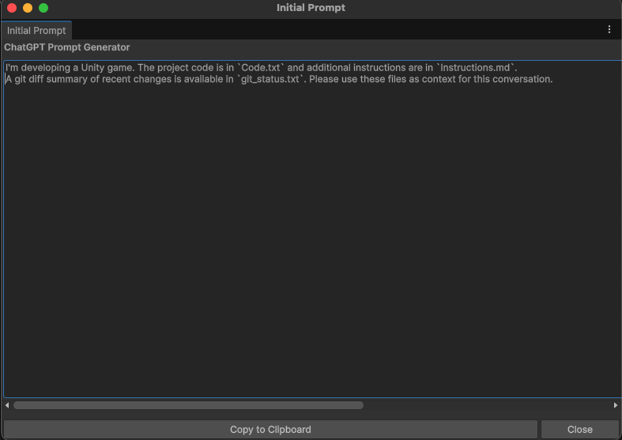

# ChatGPT Context Exporter (Unity Editor Tool)

A Unity Editor tool that exports your staged C# and Markdown files as ChatGPT-ready context (`Code.txt`, `Instructions.md`, and optional `git_status.txt`).

---

## Features

- Stage/unstage system for `.cs` and `.md` files  
- Search and filter support for staged files  
- Git diff export (`git log` + `git diff` with author/grep filters)  
- Prompt generator with **New**, **Ongoing**, or **Don’t Open** modes  
- Quick range selectors: **Last 24h**, **Last 7 Days**, **This Month**, **All Time**  
- Persistent settings via `EditorPrefs`  
- Fully modular architecture (`FileStagingManager`, `GitIntegration`, `PromptWindow`, etc.)

---

## Installation

You can install this package via **Git URL** using Unity’s Package Manager.

1. Open **Unity → Window → Package Manager**  
2. Click **+ → Add package from git URL...**  
3. Paste the following link:

```
https://github.com/zenoxzx/chatgpt-context-exporter.git#upm
```

Alternatively, you can edit your `Packages/manifest.json` file directly:

```json
{
  "dependencies": {
    "com.zenoxzx.chatgpt-context-exporter": "https://github.com/zenoxzx/chatgpt-context-exporter.git#upm"
  }
}
```

---

## Usage

After installing the package, open the exporter from the Unity menu:

```
Tools → ChatGPT → Project Context Exporter
```

### **Main Tabs**

| Tab | Description |
|-----|--------------|
| **Code** | Stage or unstage `.cs` files to include in `Code.txt`. |
| **Instructions** | Stage `.md` instruction files for `Instructions.md`. |
| **Settings** | Configure export and root paths. |
| **Git** | Export git diff and logs within a selected date range. |

---

### 📸 Screenshots

#### 🧱 Code Tab
Shows the staging system for `.cs` files — select which code files will be exported to `Code.txt`.



#### 📘 Instructions Tab
Stage `.md` documentation or design files for `Instructions.md`.



#### ⚙️ Git Tab
Select a date range, apply filters, and export diffs to `git_status.txt`.



#### 💬 Prompt Window
The generated prompt window shown after export (if enabled).  
You can copy the prompt directly to ChatGPT.



---

### **Git Export Options**

- **Quick Range Buttons:** Quickly set date ranges such as _Last 24h_, _Last 7 Days_, _This Month_, or _All Time_.  
- **Author Filter:** Filter commits by author.  
- **Grep Filter:** Search commit messages by keyword.  
- **Export Git Status:** Enable or disable inclusion of `git_status.txt`.

---

### **Prompt Modes**

When exporting, the prompt window can behave in three ways:

| Mode | Description |
|------|--------------|
| **New Conversation** | For starting a brand-new ChatGPT discussion about the project. |
| **Ongoing Conversation** | For continuing a previous ChatGPT conversation (updates only). |
| **Don't Open Prompt Window** | Skips opening the prompt window after export. |

---

## Folder Structure

```
com.zenoxzx.chatgpt-context-exporter/
│
├── package.json
├── CHANGELOG.md
├── LICENSE.md
├── README.md
│
└── Editor/
    ├── ChatGPTContextExporter.asmdef
    ├── ProjectContextExporterWindow.cs
    ├── PromptWindow.cs
    ├── PromptMode.cs
    ├── Tab.cs
    ├── GitIntegration.cs
    └── FileStagingManager.cs
 
```

---

## Example Output Files

After pressing **Export**, three files are generated in your chosen export directory:

```
Code.txt
Instructions.md
git_status.txt  (if Export Git Status is enabled)
```

You can then copy the auto-generated prompt from the popup window or disable it via “Don’t Open Prompt Window”.

---

## License

This package is distributed under the **MIT License**.  
See [LICENSE.md](LICENSE.md) for full details.

---

## Author

**Aygün ÖZGÜR**  
GitHub: [github.com/zenoxzx](https://github.com/zenoxzx)

---
